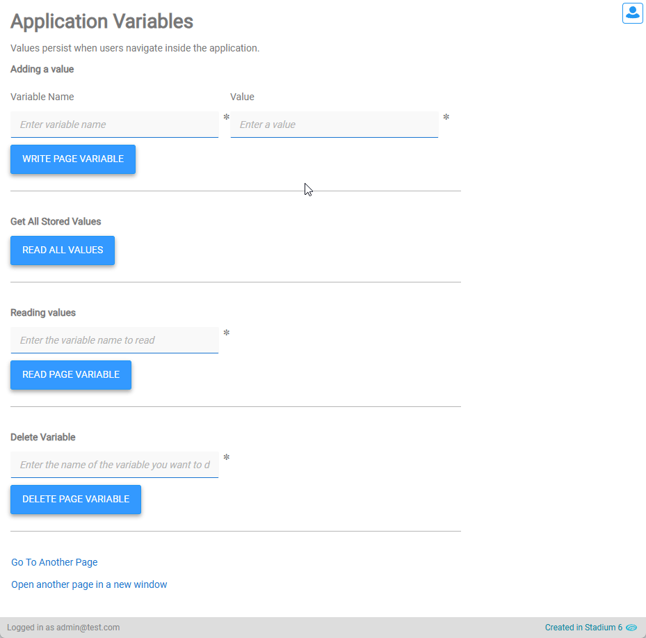

# Application Variables <!-- omit in toc -->

Sometimes it is necessary to store values across several pages. This can be achieved by passing the values between pages using the querystring or by using this script. 

This script stores values in attributes against the body tag of the page. In single-page applications, this means the values persist when users navigate between pages inside the application. When opening a new window, these values are lost and no longer exist. There is no timeout when using this method for storing values. 

Browsers implement different limits regarding the possible amount of data that can be stored in this way. Do not use this method for storing large amounts of data.

To store values on specific pages only, you can use the [Page Variables](https://github.com/stadium-software/utils-page-variables) module. 

To store values across multiple tabs in a session, you can use the Stadium Session Variables in the Application Explorer. 



# Version
Initial 1.0

# Setup

## Global Script
1. Create a Global Script called "ApplicationVariables"
2. Add the input parameters below to the Global Script
   1. Action
   2. Name
   3. Value
3. Drag a *JavaScript* action into the script
4. Add the Javascript below into the JavaScript code property
```javascript
/* Stadium Script v1.0 https://github.com/stadium-software/utils-body-variables */
let prefix = "stvar";
let nm = ~.Parameters.Input.Name;
nm = prefix + nm;
let val = ~.Parameters.Input.Value;
let action = ~.Parameters.Input.Action || "read";
let bd = document.body;
action = action.toLowerCase();
if (action == "write" || action == "add") {
    writeVariable(nm, val);
} else if (action == "remove" || action == "delete") {
    deleteVariable(nm);
} else if (action == "readall" || action == "read-all") {
    return readAllVariables();
} else {
    return readVariable(nm);
}
function writeVariable(n, v) {
    bd.dataset[n] = v;
}
function readVariable(n) {
    return bd.dataset[n];
}
function deleteVariable(n) {
    delete bd.dataset[n];
}
function readAllVariables() {
    let retArr = [];
    if (!bd.dataset) return retArr;
    let vars = Object.entries(bd.dataset).map(([name, value]) => ({ name, value }));
    for (let i = 0; i < vars.length; i++) {
        let n = vars[i].name.replace(prefix, "");
        let v = vars[i].value;
        if (isJsonString(v)) {
            v = JSON.parse(v);
        }
        let obj = {};
        obj[n] = v;
        retArr.push(obj);
    }
   return retArr;
}
function isJsonString(str) {
    try {
        JSON.parse(str);
    } catch (e) {
        return false;
    }
    return true;
}
```

## Event Handler or Script
1. Drag the "ApplicationVariables" to the event handler or script
2. Complete the input parameters
   1. Action (default is "read")
      1. read
      2. write
      3. remove
      4. readall (returns a list of objects)
   2. Name: The name of the variable you wish to read, write or remove
   3. Value: The value you wish to write. 

**NOTE: Browsers implement different limits regarding the possible amount of data that can be stored in this way. Do not use this method for storing large amounts of data.**

## Upgrading Stadium Repos
Stadium Repos are not static. They change as additional features are added and bugs are fixed. Using the right method to work with Stadium Repos allows for upgrading them in a controlled manner. 

How to use and update application repos is described here: [Working with Stadium Repos](https://github.com/stadium-software/samples-upgrading)